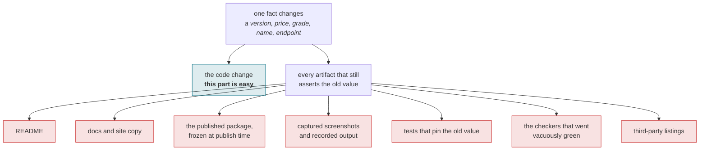

# claim-sweep

[](LICENSE)
[-0b7285)](https://efaimo.ai/skills)
[](https://github.com/efaimo-ai/claim-sweep/actions/workflows/house-style.yml)

An Agent Skill for the moment a fact about your project changes and you have to
find everything that still says the old one.

Not the code change. The **sweep**: the README, the docs, the site copy, the
screenshot at the top of the README with the old number rendered into it, the
package you published last week, the test that asserts the old value, the check
you wrote to watch the claim and which now watches nothing, and the listing on
somebody else's site that scraped you in July.

## The shape of a sweep



The hardest carriers are the last two: a checker that was watching the old value
now passes over nothing, and a listing you do not own keeps serving the old claim
to people who never see your repository.

## The problem

Retiring a claim is easy to do and hard to finish. Changing the fact takes a
minute; enumerating what was carrying it is the part that gets skipped, and each
survivor looks authoritative because the file it lives in was correct when it
was written.

Grepping for the old value is the obvious move and it finds the easy half. It
cannot see a number baked into a screenshot, a value inside a published tarball,
a count spelled as a word, a test that agrees with the bug, a checker that has
gone quiet, or a directory site that holds its own copy.

So this skill leads with a carrier list and searches each carrier on its own
terms.

## Install

Claude Code and other agents that read `SKILL.md` from a skills directory:

```bash
git clone --depth 1 https://github.com/efaimo-ai/claim-sweep \
  ~/.claude/skills/claim-sweep
```

Or vendor the directory anywhere your agent loads skills from. There is nothing
to build and no dependencies.

## What it contains

| file | what it is |
|---|---|
| `SKILL.md` | the procedure, and the carrier list in one line each |
| `references/carriers.md` | all eight carrier categories with the search that finds each |
| `references/guards.md` | how to make the next drift loud instead of silent |

`SKILL.md` is small on purpose. It is what an agent loads at trigger time; the
references load only when the sweep actually needs them.

## When it fires

A version, number, grade, price, date, default, endpoint, or name changes. Two
places disagree about the same figure. Someone asks whether a published claim is
still true. You are about to launch, release, rename, or announce a migration.

## The part worth reading even if you never install it

When you retire a claim, the tooling that was watching it does not start
failing. It starts **succeeding vacuously**: it searches for a sentence you
deleted, finds nothing, and reports zero problems. "Zero problems" and "nothing
was checked" produce identical output unless somebody wrote the difference in.

Make an empty harvest a failure. It is one line, and it catches more silent
breakage than anything else in `guards.md`, because subjects get renamed and
moved far more often than they get broken.

## Scope

This is a procedure, not a linter. There is nothing to run.

It tells you where a claim is **repeated**. It does not tell you whether the new
value is **correct** - deciding that is your job. What it makes sure of is that
the old one stops being published.


## The set

Seven skills, each one a discipline that cost something to learn.

| skill | the question it asks |
|---|---|
| [`red-before-green`](https://github.com/efaimo-ai/red-before-green) | can this check fail at all? |
| [`denominator`](https://github.com/efaimo-ai/denominator) | how much of the world can it see? |
| [`read-back`](https://github.com/efaimo-ai/read-back) | did the write actually apply? |
| **`claim-sweep`** (this one) | what else still asserts the old value? |
| [`unreleased-guard`](https://github.com/efaimo-ai/unreleased-guard) | does the copy describe what shipped? |
| [`honest-chart`](https://github.com/efaimo-ai/honest-chart) | is the picture proportional to the data? |
| [`mcp-stateless-migration`](https://github.com/efaimo-ai/mcp-stateless-migration) | does this server match the 2026-07-28 spec? |

All of them are audited by [`efaimo`](https://github.com/efaimo-ai/efaimo), the
CLI that measures the quality and context-window cost of MCP servers and Agent
Skills. The index of every public skill it can find, graded, is at
[efaimo.ai/skills](https://efaimo.ai/skills).

## License

Apache-2.0. See [`LICENSE`](LICENSE) and [`NOTICE`](NOTICE).
